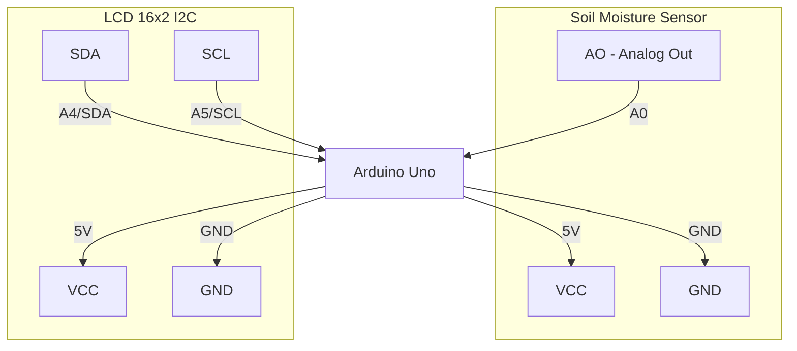

# Soil Moisture Sensor — Arduino Connections

## Components
- Arduino Uno
- Soil Moisture Sensor (analog)
- 16x2 LCD Display (I2C module, address 0x20 — MCP23008-based)

## Wiring Diagram

## Pin Reference Table

| Component | Component Pin | Arduino Pin |
|-----------|--------------|-------------|
| Soil Moisture Sensor | VCC | 5V |
| Soil Moisture Sensor | GND | GND |
| Soil Moisture Sensor | AO | A0 |
| LCD I2C Module | VCC | 5V |
| LCD I2C Module | GND | GND |
| LCD I2C Module | SDA | A4 (SDA) |
| LCD I2C Module | SCL | A5 (SCL) |
