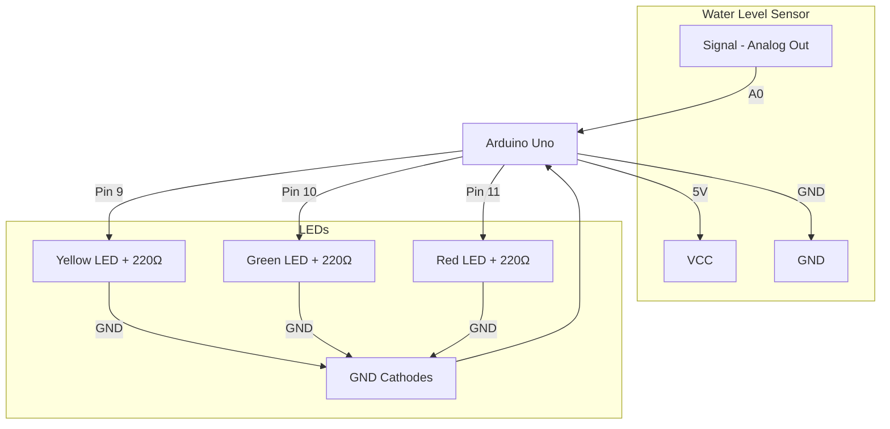

# Water Level Sensor — Arduino Connections

## Components
- Arduino Uno
- Water Level Sensor (analog)
- Yellow LED (Low)
- Green LED (Average)
- Red LED (High)
- 3x 220Ω Resistors

## Wiring Diagram

## Pin Reference Table

| Component | Component Pin | Arduino Pin |
|-----------|--------------|-------------|
| Water Level Sensor | VCC | 5V |
| Water Level Sensor | GND | GND |
| Water Level Sensor | Signal | A0 |
| Yellow LED (Low) | Anode via 220Ω | Pin 9 |
| Green LED (Average) | Anode via 220Ω | Pin 10 |
| Red LED (High) | Anode via 220Ω | Pin 11 |
| All LEDs | Cathode | GND |
